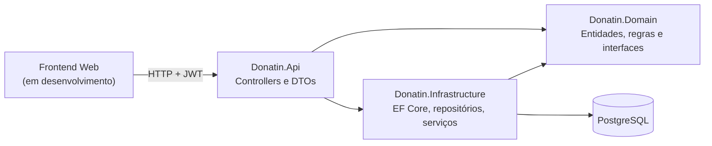
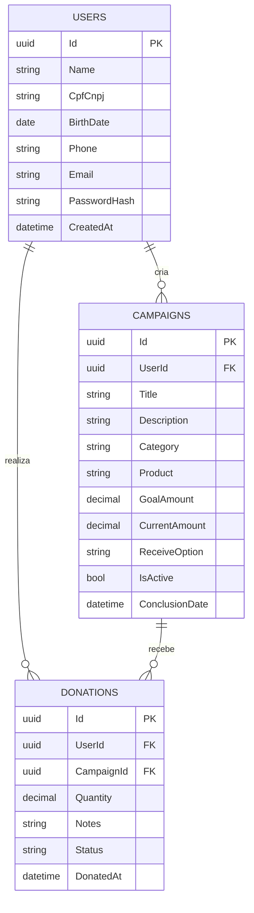

# Donatin

> Plataforma web que conecta quem quer doar a quem precisa: instituições e pessoas criam campanhas, doadores contribuem e o recebimento é confirmado de forma rastreável.


Projeto de conclusão de curso (TCC / Portfólio) de Engenharia de Software da **Católica SC**, na linha **Web Apps**. O foco atual é uma aplicação web consumindo a API em .NET; o aplicativo mobile (Flutter) fica como evolução posterior.

**Autor:** Guilherme Mafra Paluski

---

## Sobre o projeto

### O problema

Instituições carentes dependem de doações de objetos (cobertores, roupas, itens de higiene, móveis) para cobrir necessidades sazonais. Do outro lado, quem quer doar esbarra em três barreiras: falta de confiança nas instituições, falta de praticidade e falta de informação sobre **onde** e **como** doar. O resultado é a desistência da doação e o descarte de itens perfeitamente utilizáveis.

Uma pesquisa de campo (16 respostas) indicou que 87,5% já tiveram vontade de doar itens físicos e desistiram por não saber onde ou como entregar, e que 100% usariam uma plataforma centralizada para isso.

### A solução

O Donatin centraliza o processo: instituições publicam **campanhas** com meta e prazo, doadores registram **doações** para elas e o receptor **confirma o recebimento**, atualizando o progresso da campanha. Está previsto o agendamento de entrega/coleta, que é o diferencial frente aos concorrentes analisados (Givee, Doação do Bem, Solidarizando e Geev), nenhum dos quais oferece logística estruturada de objetos físicos.

### Público-alvo e lançamento

- **Doadores** (pessoas físicas) que querem doar objetos do cotidiano de forma prática.
- **Instituições** (ONGs, igrejas, ações sociais) que querem divulgar necessidades e organizar o recebimento.
- **Estratégia de lançamento:** pré-cadastro manual de 3 a 5 instituições locais e escopo geográfico inicial restrito a Joinville (SC), para resolver o problema do "ovo e da galinha".

---

## Status atual

| Módulo | Estado |
|---|---|
| Autenticação (cadastro, login, JWT) | Implementado |
| Campanhas (CRUD, busca por categoria e palavra-chave, encerramento) | Implementado |
| Doações (registrar, histórico, confirmar recebimento, cancelar) | Implementado |
| Perfil do usuário (`/users/me`) | Em andamento |
| Frontend web | Em andamento |
| Deploy em nuvem | Planejado |
| Agendamento de entrega/coleta | Planejado |
| Upload de imagens | Planejado |
| Notificações, denúncias, geolocalização | Planejado (evolução) |
| App mobile (Flutter) | Protótipo de telas; evolução posterior |

---

## Arquitetura e stack

| Camada | Tecnologia |
|---|---|
| Backend | ASP.NET Core (.NET 10), Entity Framework Core, Npgsql |
| Banco de dados | PostgreSQL 15 |
| Autenticação | JWT Bearer, senhas com BCrypt |
| Infraestrutura | Docker e Docker Compose |
| Frontend | Web (em desenvolvimento, consumindo esta API) |
| Mobile (evolução) | Flutter |

A API segue **Clean Architecture** em três projetos, com **modelo de domínio rico** (validações e transições de estado dentro das entidades):



### Modelo de dados



O cadastro de usuário também guarda o endereço completo (CEP, rua, bairro, número, complemento, cidade e UF), omitido no diagrama por brevidade.

---

## Como rodar

### Pré-requisitos

- [Docker](https://www.docker.com/) com Docker Compose (para o modo Docker)
- [.NET 10 SDK](https://dotnet.microsoft.com/download) e um PostgreSQL 15+ local (apenas para o modo `dotnet run`)

### Arquivos de ambiente (leia antes de rodar)

O projeto usa **dois arquivos `.env` diferentes**, cada um lido por uma parte do sistema. Copiar só um deles não basta:

| Arquivo | Quem lê | Variáveis | Quando é necessário |
|---|---|---|---|
| `.env` na **raiz** | `docker-compose.yml` | `DOCKER_POSTGRES_PASSWORD` | Só ao usar Docker |
| `api/.env` | A API (via DotNetEnv e `env_file` do compose) | `Jwt__Secret`, `ConnectionStrings__DonatinDb` | **Sempre** (Docker ou `dotnet run`) |

Crie os dois a partir dos exemplos versionados:

```bash
cp .env.example .env
cp api/.env.example api/.env
```

**`.env` (raiz)**, usado pelo compose:

```dotenv
DOCKER_POSTGRES_PASSWORD=escolha_uma_senha
```

**`api/.env`**, usado pela aplicação:

```dotenv
Jwt__Secret=uma_chave_aleatoria_com_pelo_menos_32_caracteres
ConnectionStrings__DonatinDb=Host=localhost;Port=5432;Database=donatin_db;Username=SEU_USUARIO;Password=SUA_SENHA
```

Observações importantes:

- **No modo Docker**, o compose sobrescreve `ConnectionStrings__DonatinDb` para apontar para o container do banco (`Host=db`). Já o `Jwt__Secret` continua vindo do `api/.env`, por isso esse arquivo é obrigatório nos dois modos.
- **No modo `dotnet run`**, a connection string do `api/.env` é a que vale, então ela deve apontar para o seu PostgreSQL local.
- O `Jwt__Secret` precisa ter **no mínimo 32 caracteres**; a API se recusa a iniciar sem ele. Para gerar um: `openssl rand -base64 48`.
- Escreva comentários em **linha própria**, nunca na mesma linha do valor, pois alguns leitores de `.env` os incluem no valor.
- Os dois `.env` estão no `.gitignore`. Nunca versione segredos; apenas os arquivos `.env.example`.

### Opção A: Docker (recomendado)

Sobe a API e o PostgreSQL juntos:

```bash
docker compose up --build
```

- A API responde na porta publicada em `docker-compose.yml` (`ports` do serviço `api`; por padrão `http://localhost:5080`). A porta 5000 é evitada de propósito, pois o AirPlay Receiver do macOS a ocupa.
- O banco fica exposto em `localhost:5433` para ferramentas externas.
- As **migrations são aplicadas automaticamente** na subida da API.

| Comando | O que faz |
|---|---|
| `docker compose up -d` | Sobe em segundo plano |
| `docker compose logs -f api` | Acompanha os logs da API |
| `docker compose down` | Para tudo, mantendo os dados do banco |
| `docker compose down -v` | Para tudo e **apaga** os dados do banco |

Use `--build` sempre que alterar o código da API.

### Opção B: `dotnet run` (desenvolvimento)

1. Garanta um PostgreSQL rodando e um banco criado, com a connection string correspondente no `api/.env`.
2. Execute:

```bash
cd api/Donatin.Api
dotnet run
```

A porta está definida em `Properties/launchSettings.json`. As migrations também são aplicadas na subida.

> Os dois modos usam **bancos distintos** (o local e o do container), então usuários e campanhas criados em um não aparecem no outro.

### Testando a API

Use o Postman ou o arquivo `api/Donatin.Api/Donatin.Api.http`. Um fluxo completo de teste precisa de **duas contas**, pois ninguém pode doar para a própria campanha:

1. Cadastre e faça login com a conta A (dona) e a conta B (doadora) em `/api/auth`.
2. Com o token da A, crie uma campanha em `POST /api/campaigns`.
3. Com o token da B, doe em `POST /api/donations` (o corpo leva `campaignId`, `quantity` e `notes`).
4. Com o token da A, confirme em `POST /api/donations/{id}/confirm`.
5. Consulte `GET /api/campaigns/{id}` e veja o `currentAmount` atualizado.

Rotas autenticadas exigem o header `Authorization: Bearer <token>`.

---

## API

| Método | Rota | Auth | Descrição |
|---|---|---|---|
| POST | `/api/auth/register` | Não | Cria conta e retorna o JWT |
| POST | `/api/auth/login` | Não | Autentica e retorna o JWT |
| GET | `/api/campaigns` | Não | Lista campanhas ativas (`?category=&keyword=`) |
| GET | `/api/campaigns/{id}` | Não | Detalhe da campanha |
| GET | `/api/campaigns/user/{userId}` | Não | Campanhas de um usuário |
| POST | `/api/campaigns` | Sim | Cria campanha |
| PUT | `/api/campaigns/{id}` | Sim (dono) | Atualiza a campanha (substituição completa) |
| DELETE | `/api/campaigns/{id}` | Sim (dono) | Encerra a campanha (soft delete) |
| POST | `/api/donations` | Sim | Registra uma doação para uma campanha |
| GET | `/api/donations/mine` | Sim | Histórico de doações do usuário |
| GET | `/api/donations/campaign/{campaignId}` | Sim (dono da campanha) | Doações recebidas por uma campanha |
| GET | `/api/donations/{id}` | Sim (doador ou dono da campanha) | Detalhe da doação |
| POST | `/api/donations/{id}/confirm` | Sim (dono da campanha) | Confirma o recebimento |
| POST | `/api/donations/{id}/cancel` | Sim (doador ou dono da campanha) | Cancela uma doação pendente |

### Regras de negócio das doações

- Toda doação nasce como **Pendente**.
- Só o **dono da campanha** confirma o recebimento; nesse momento a doação vira **Concluída** e o progresso da campanha é atualizado, na mesma transação.
- Uma doação **Concluída** ou **Cancelada** não pode mais mudar de estado.
- Não é possível doar para a própria campanha, nem para campanhas encerradas ou expiradas.

---

## Decisões de projeto

Desvios conscientes em relação ao RFC original:

- **Web primeiro.** O projeto foi reposicionado da linha Mobile para Web Apps, reduzindo o risco de entrega. O Flutter fica como evolução se o prazo permitir.
- **Doação é uma contribuição a uma campanha**, e não um anúncio avulso do doador como descrito no RFC original.
- **Sem distinção de tipo de usuário.** Qualquer usuário autenticado pode criar campanhas (RN02 não será implementada).
- **Sem camada de Services.** As regras ficam nas entidades de domínio, e os controllers usam os repositórios diretamente.
- **Atualização de campanha por `PUT`** (substituição completa), e não por `PATCH`.
- **Enums gravados como texto**, com nomes sem acentos, para evitar problemas de encoding.
- **Datas sempre em UTC** na API.
- **Campanhas encerradas por soft delete**, preservando o histórico.

---

## Estrutura do repositório

```
Donatin/
├── api/
│   ├── Donatin.Api/             # Controllers, DTOs, Program.cs
│   ├── Donatin.Domain/          # Entidades, enums, interfaces
│   ├── Donatin.Infrastructure/  # DbContext, migrations, repositórios, serviços
│   ├── Dockerfile
│   └── .env.example
├── app/                         # Protótipo Flutter (evolução futura)
├── docs/                        # RFC do projeto
├── docker-compose.yml
└── .env.example
```

---

## Roadmap

- [x] Autenticação com JWT
- [x] Campanhas
- [x] Doações com confirmação de recebimento
- [x] Containerização com Docker Compose
- [ ] Perfil do usuário (`/users/me`)
- [ ] Frontend web
- [ ] Deploy em nuvem
- [ ] Testes automatizados e CI
- [ ] Agendamento de entrega e coleta
- [ ] Upload de imagens
- [ ] Notificações, denúncias e busca por proximidade
- [ ] Aplicativo mobile Flutter (futuro)

---

## Documentação

A especificação completa (personas, requisitos funcionais e não funcionais, regras de negócio, benchmark e cronograma) está no RFC em [`docs/`](docs/). Ele está sendo atualizado para refletir o foco web e as decisões acima.

## Contexto acadêmico

Projeto desenvolvido individualmente na disciplina de Portfólio do curso de Engenharia de Software da Católica SC, seguindo as diretrizes do [The Portfolio Playbook](https://github.com/CatolicaSC-Portfolio/The-Portfolio-Playbook).
